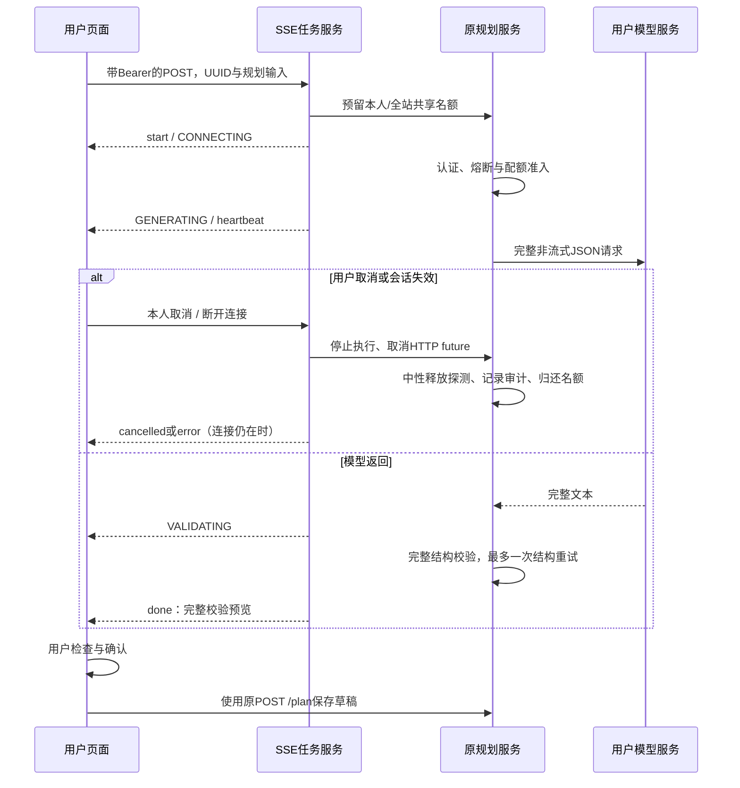

# AI规划SSE开发与答辩复盘

2026-09-29，分支`codex/ai-planner-sse`。用户在`/ai-planner`配置自己的兼容API地址、模型和Key，生成时可看实际处理阶段、已等待秒数，并取消等待。只有完整行程通过结构校验才展示预览；保存仍需用户确认后调用原规划接口。默认开启进度，可关闭选项使用已有普通生成。

本批为下游阶段SSE，上游仍发送`stream:false`的完整Chat Completions请求。没有模型逐token输出、RAG问答、自动优化已存规划或真实模型质量验收。旧API无需迁移，无新增表或SQL升级。

## 理解链路



关键文件：`PlannerController`增加流/状态/取消路由；`PlannerStreamService`维护有界作业、认证心跳和终态；`PlannerExecution`传递停止原因、HTTP future、阶段和提交回调；`PlannerService`共用新旧生成管线；`CompatiblePlannerClient`把等待接到可取消future。前端`plannerStream.ts`解析事件，`planner.ts`经现有Axios客户端使用fetch stream adapter，`AiPlanner.vue`显示阶段并控制取消/普通生成。

## 为什么这样实现

POST需要Bearer和用户输入，使用fetch流读取而非URL中的token。Axios保留原会话刷新、跨标签页Web Locks和epoch保护；初始HTTP401可按既有方式恢复，已经开流的error/401只结束本次任务，不自动重放模型调用。账号变更/组件离页中断流，旧请求不能落到新账号预览。

SSE只是传输格式，并不要求上游也流式。现有完整JSON校验已有每天条目数、金额、字段长度、天数、排序和不可信ID防护；先保留这条可靠路径。阶段含CONNECTING/GENERATING/VALIDATING/RETRYING和attempt=1/2。页面不显示编造的百分比，模型阶段持续较长是正常等待。

同一实例每用户1个模型操作、总8个名额。旧generate、test和新SSE通过Slot共享限制；close幂等，避免普通异常、取消和SSE finally重复释放。审计结束后归还名额，让终态之前的用量查询具有一致记录。线程池8个worker、有界队列8；最近任务最多2048个，完成记录保留10分钟，启动和查询时惰性清理。请求ID在保留期间不可复用，刷新页面不会恢复未完成任务。

取消future能让等待线程及时退出，不使用`Thread.interrupt()`破坏后续Redis探测释放和SQL审计。停止原因第一项生效：499取消/断连，401会话失效，408整体截止，503认证等依赖不可用。外呼前、返回后、提交前和每次心跳再次校验会话；已经退出/轮换/禁用的账号不能继续接收完整结果。

RUNNING可以进入CANCELLING再终态，也可在校验/授权通过后进入FINISHING，再SUCCEEDED。FINISHING是结果提交边界，此时取消返回409，前端继续接收结果。终态写入幂等，确保一任务最多一个done/error/cancelled。断开的客户端无法收到终态，这是物理限制；可以在仍有效的登录下查询本人状态。内部Servlet ASYNC派发放行是异步完成需要，首次外部HTTP仍经JWT过滤，匿名流接口实际HTTP401。

启动前非法参数、重复UUID、并发/地址限制返回普通HTTP200/code错误JSON。开流后HTTP头已发出，业务失败用error事件表达，不能再改HTTP状态。规划专属异常处理显式指定JSON，修复Accept只接受SSE时的错误协商空响应。客户端先看Content-Type，再决定读取R还是事件。

解析器保留UTF-8解码器状态，支持LF/CRLF/CR跨块、注释和多行data，按UUID关联，检查阶段/尝试数与完整预览最低结构，限制总响应2MiB，缺失终态不作成功。长行仅扫描新数据、遇换行才合并，避免极小分块下反复扫描整行。后端完整语义校验仍是权威，前端检查用于阻止损坏流被渲染。

## 配额、故障与取消怎样解释

配额在实际HTTP调用之前准入，连接测试和每次结构重试各扣一次。取消前尚未准入不扣次；已经准入不退款。准入到发送之间存在很小竞争窗口，取消可能在供应商收到请求之前发生，此时仍按已准入计费口径扣次，不能宣传为精确供应商计费对账。

主动取消、断连、认证失效、整体截止属于本地停止，调用`circuit.abandon`，不作为供应商失败；半开探测被取消后允许后续新探测。真实供应商错误和无效行程仍计故障。若供应商已经成功返回且记录成功样本、随后在提交前取消/认证失效，已完成供应商成功样本可以保留，业务操作仍失败；二者统计层次不同。

操作日志按一次用户生成计1行，与最多2次配额/故障样本不同。取消审计CANCELLED，其他停止STOPPED_401/408/503，仅保留安全标记和model/耗时，不持久化Key、地址、需求或原始供应商正文。正常取消时HTTP传输可能已被供应商消费，停止本地等待不能保证供应商停止生成或退费。

取消按钮放在被禁用的表单外。取消API若返回409，保留完成中的结果；其他取消请求失败时先中止本地流，服务器随后通过写入或心跳发现断连。提示只承诺“停止本次等待、未保存”，不声称供应商已终止。

## 配置、复现及部署

默认每次上游45秒、最多两次；SSE容器截止125秒、心跳5秒、前端130秒。服务主动在容器截止前一个心跳周期停止，留出终态时间。配置限制：总时长2—180秒、心跳1—15秒且小于总时长。默认配置足够现有两次调用；缩短时长意味着更早停止。反向代理必须允许长连接、禁缓冲，实际代理环境仍须专项验收，响应头本身不保证所有代理遵守。

独立超时验收可在后端目录执行：

```powershell
mvn dependency:build-classpath '-Dmdep.outputFile=target/sse-classpath.txt'
$sseClassPath='target/classes;'+(Get-Content target/sse-classpath.txt -Raw).Trim()
& "$env:JAVA_HOME/bin/java.exe" -cp $sseClassPath com.trip.TripServerApplication `
  --server.port=8081 --spring.devtools.restart.enabled=false --spring.ai.model.chat=none `
  --trip.ai.stream.timeout-seconds=5 --trip.ai.stream.heartbeat-seconds=1 `
  --trip.ai.circuit.key-prefix=trip:test:circuit:sse-timeout `
  --trip.ai.quota.key-prefix=trip:test:quota:sse-timeout
```

先用`mvn compile`生成当前类；JAVA_HOME需指向JDK17以上，不能误用PATH旧Java8。本轮用JDK21。若自定义测试前缀，也要同步脚本参数。数据库/Redis沿用开发实例，只创建自己的夹具，不运行schema.sql。测试和失败表见[实测文档](AI规划SSE接口与页面实测.md)。

当前任务/取消为进程内状态，重启丢失任务；多实例需要相同用户路由到同一节点，否则状态404/无法取消，且单机并发限制不是集群总限制。Redis配额和故障状态仍共享，但不能代替任务路由。无恢复游标/断线续传/自动补发。慢客户端、代理断连检测、长时间极限负载与真实供应商仍待部署验收。

## 答辩演示与常见问题

按“基础推荐→自己的API配置→生成时看阶段→取消→重新生成→检查预览→确认保存编辑”演示。没有真实Key时使用本机受控服务并明确说明夹具，不能把固定行程当作AI内容质量证据。解释116项接口/32项生命周期/40项页面及解析器的不同范围，再展示一处真实失败和修复。

**为什么不逐字输出行程？** 行程需要完整结构与金额校验，未完整返回的文本不可当作可保存草稿。本批先让等待过程可见、可停止。

**取消是不是不花钱？** 已准入扣本系统额度，供应商可能已计费；只保证停止后台等待并不把取消误记供应商故障。

**有SSE为什么还保留普通生成？** 代理/客户端可能不支持长连接，用户可手动关闭进度重新操作；系统不自动补发，防止重复外呼。

**断线后为什么没有done？** 客户端已断开，终态无法通过该连接到达；页面不会伪装成功，同实例状态接口保留10分钟。

**接下来做什么？** 先审核并融合此PR；下一独立分支再实现知识文档导入、查询检索与带来源的RAG回答。真实模型质量与供应商适配按用户配置验证，不扩大本次提交范围。

参考：[Spring MVC异步请求与SseEmitter](https://docs.spring.io/spring-framework/reference/web/webmvc/mvc-ann-async.html)、[MDN SSE事件格式](https://developer.mozilla.org/en-US/docs/Web/API/Server-sent_events/Using_server-sent_events)、[Axios fetch adapter](https://github.com/axios/axios?tab=readme-ov-file#fetch-adapter)。这些资料解释机制，本项目是否正确仍由上述实际证据验证。
