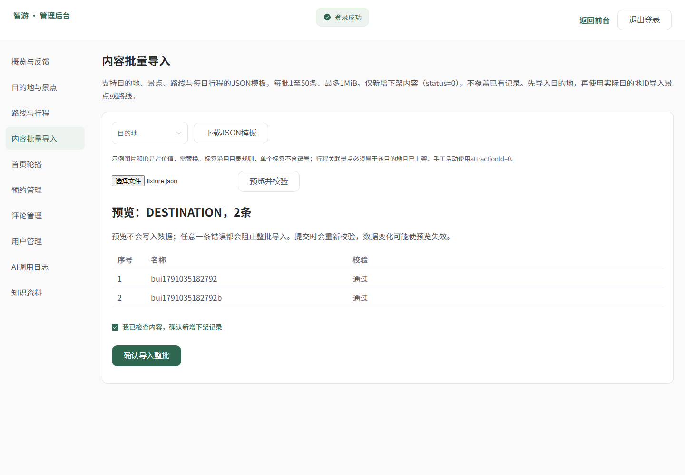
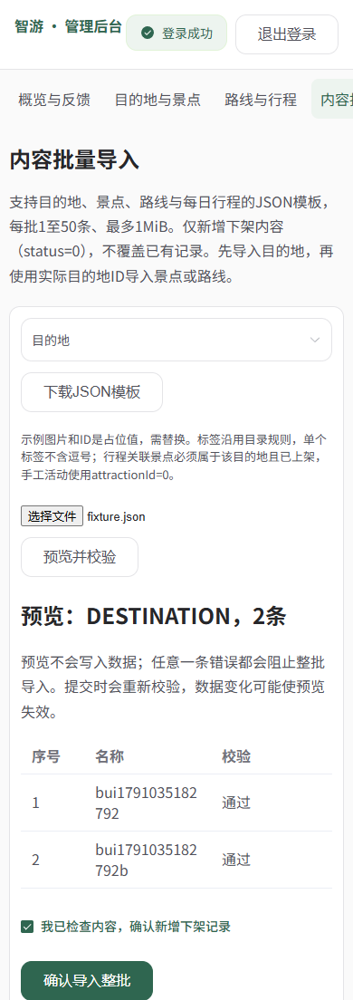

# 用户导出、内容批量导入、账号注销：接口与页面实测

2026-10-03，北京时间。分支 `codex/basic-data-tools` 从 `origin/main=eb0ace2` 建立。本批调用真实本机 Spring Boot、MySQL、Redis，以及 Edge/Vue 页面，不使用模拟业务接口、不调用模型。所有写操作只使用本批生成的账号和内容，结束后清理这些测试数据。

## 结果与证据

| 验证 | 实际结果 | 证据 |
|---|---|---|
| 本批 HTTP / SQL / Redis 最终验收 | 114/114，COMPLETED | [最终响应](evidence/basic-data/20261003-214736-final-closure-http.json) |
| 前期与扩展检查 | 93/93、94/94、104/104、106/106 | [初验](evidence/basic-data/20261003-213217-initial-http.json)、[修正后](evidence/basic-data/20261003-213704-final-http.json)、[并发导入](evidence/basic-data/20261003-214335-delivery-http.json)、[上传框架限制](evidence/basic-data/20261003-214617-final-expanded-http.json) |
| Edge 真实下载 / 导入 / 注销 | 28/28，COMPLETED | [最终浏览器结果](evidence/basic-data/2026-10-03T13-46-22-792Z-browser/results.json) |
| 密码与会话回归 | 75/75 | [响应](evidence/password/20261003-214356-663601-final.json) |
| 目录与后台回归 | 140/140 | [响应](evidence/admin/20261003-214400-941604-final.json) |
| Maven | 48项，0失败/错误/跳过，BUILD SUCCESS | [构建日志摘录](evidence/basic-data/verification.json)，新增CSV转义2项 |
| vue-tsc / Vite | 构建通过 | [摘录](evidence/basic-data/verification.json)，主包1130.09kB；原大包警告仍保留 |

测试项包含接口调用、SQL断言、Redis断言和清理，不等于114个不同接口。并发赢家不同，后续重复运行的计数可能随是否拿到刷新成功的Token对而变化。原构建日志被忽略，不提交含运行凭据的服务日志。证据中的密码、JWT字段已脱敏，截图的密码输入已遮盖。

## 实际响应与数据断言

API基础路径 `/api`。安全过滤器拒绝匿名/普通用户访问ADMIN功能时HTTP分别401/403；业务校验一般HTTP200，必须同时读取JSON `code`。

| 场景 | 实际结果 |
|---|---|
| 按管理员测试账号关键词导出 | HTTP200，UTF-8 BOM，attachment，Cache-Control:no-store；CSV只有表头和匹配用户，含8个公开管理字段；不含密码/Token/手机号/邮箱 |
| 昵称以空格和公式符号开头 | CSV解析后昵称带前置单引号，避免作为表格公式执行 |
| 无匹配用户 / status=2 | 仅表头 / HTTP200、code400 |
| 目的地2条预览 | code200，valid=true，SQL内容数量不变 |
| 目的地2条提交 | code200，ids=[265,266]，replayed=false；SQL新记录status均0 |
| 相同文件相同UUID再次提交 | ids仍[265,266]，replayed=true；不重复创建 |
| 同一UUID换文件 | code409，message="请求编号已用于其他文件，请重新预览" |
| 同一UUID并发提交 | 两次code200，同一id267；replayed分别false/true，只创建一次 |
| 景点与嵌套路线导入 | 均成功；管理详情读取到真实route_day/route_item中的“自由活动” |
| 一条合法、一条类型错误 | 预览valid=false；提交code400，message="导入校验未通过，请重新预览并修正；本批未写入"；合法行也未插入 |
| café / cafe 文件内重名 | 修正后预览valid=false；提交code400，无新增记录 |
| 预览后目录已被另一个请求新增同名记录 | 提交code400；整批第二条未创建 |
| 1MiB以上、6MiB文件 | code400，提示JSON文件1MiB限制 |
| 11MiB超过dev配置10MB单文件框架上限 | code400，message="请提供file字段中的JSON文件，单批不超过1MiB" |
| 错密码注销 | HTTP200/code400，message="当前密码不正确"，账号保持可用 |
| 有待确认预约注销 | HTTP200/code409，message="还有待确认或已确认预约，请先取消或完成预约" |
| 取消预约后本人注销 | HTTP200/code200/data=null；SQL deleted=1/status=0/昵称已注销用户，phone/email/city清空 |
| 两设备旧access/refresh Token | access被HTTP401拒绝；refresh也被拒绝；Redis本人会话为空 |
| 注销账号重新登录 | HTTP200/code1001，message="用户名或密码错误" |
| 无关账号 | 资料接口保持code200 |

还实测了：匿名注销、管理员注销保护、错误确认文字、数字密码、额外userId、未知导入字段、字段类型强制、根version溢出、重复JSON键、非法JSON、空/51条、错误目的地、路线天数不一致、关联未上架景点、带逗号标签、上架内容拒绝、数据库重名、文件内重名。具体请求和响应保存在最终JSON，不用预设期望代替服务端结果。

### 两类注销并发

最终注销/预约并发返回：注销code200，预约code401“账号已不可用，请重新登录”；数据库为已注销且没有未结束预约。之前扩展检查也观察到预约先成功、注销409的另一种合法顺序，保留证据。

最终注销/刷新并发返回：注销code200，刷新code401；数据库deleted=1，Redis会话为空，旧Token不能访问。验证最终状态，不宣称跨Redis/MySQL分布式事务或所有已进入业务方法的请求都被中断。

## 页面验收

管理员用户页真实点击导出，浏览器收到users.csv，内容匹配筛选且含BOM；导入页下载可解析的模板，错误预览阻止提交，合法预览不写库，取消二次确认不写库，确认后新增两条下架记录，完成后禁用重复按钮。管理员个人资料不显示注销入口。

普通用户注销取消后保持账号，错误密码响应400并留在原页，正确密码确认后跳转登录且清除本地认证。导入/注销页面390px无横向溢出，1440px导入页也已目视检查。早期截图捕获到取消弹窗的退场动画，补等待真实`.el-message-box`隐藏后重拍；旧图片保留，最新图片如下。





## 本批发现的问题、原因、解决与复验

| 问题 | 原因 | 解决 | 复验 |
|---|---|---|---|
| vue-tsc报TS2339：响应头值不能直接includes | AxiosHeaders类型联合不保证string | String(header或空串)后判断JSON；错误Blob解析并显示，不当CSV下载 | 最终类型检查/构建通过，实际CSV下载通过 |
| 初次路由编辑未插入导入页 | 用户管理路由通过动态map生成，按静态users文本替换未命中 | 显式添加admin/import路由和菜单 | Edge从菜单进入、上传/提交通过 |
| café/cafe预览漏报重名，提交才409 | Java字符串比较不等于MySQL utf8mb4_general_ci忽略音调规则 | 用MySQL WEIGHT_STRING生成文件内重名键，与现有表排序规则一致 | 初验记录valid=true但整批回滚；最终明确断言valid=false/code400/零新增 |
| 超过上传框架上限时提示选择PNG/JPEG | 原全局上传异常只服务图片 | 按导入URI返回JSON/file/1MiB提示，其他图片提示保留 | 11MiB真实上传命中框架异常且返回准确提示 |
| 导入预览/确认期间更换文件可能使用旧确认状态 | 异步预览或弹窗可在文件切换/离页之后结束 | revision检查、清空预览/UUID/确认，提交前再次核对版本 | 本批页面正常与取消流程通过；未单独制造慢网切换竞态 |
| 注销与新预约/刷新会话存在交错风险 | 单独逻辑删除无法约束已经认证的并发请求 | 注销、登录、创建预约和刷新使用同一账号行锁；刷新增加事务 | 实际两类并发及原75项会话回归通过 |
| 截图残留退场弹窗 | 最初等待不存在的wrapper选择器，相当于未等待动画结束 | 等待实际el-message-box隐藏 | 最新桌面截图已目视确认无遮罩 |

前两项为实施期间错误；并发和异步项为代码审查发现并补强，未声称线上已出现数据损坏。初验93项全通过仍不代表预览规则完整，所以保留初验并追加严格断言。没有删除失败/旧证据以冒充一次成功。

## 复跑与边界

在本机MySQL/Redis/8080/5173启动、迁移已执行后：

```powershell
cd trip-server
python scripts/basic_data_acceptance.py --label final
python scripts/password_acceptance.py --label final
python scripts/admin_acceptance.py --label final
# 仓库根目录
node trip-web/scripts/basic_data_browser.cjs
```

Maven需JAVA_HOME指向JDK21。本机Playwright脚本使用已安装Edge和缓存Playwright，可用PLAYWRIGHT_MODULE指定模块路径。所有验收仅允许本地API；测试会创建专属账号/内容，并删除这些测试记录及所属会话，禁止对生产数据直接运行。

本批没有真实模型调用、SMTP投递、5001用户规模导出/生产负载验证、Excel工作簿导入或异步大批任务。注销保留历史业务和用户名；历史预约联系方式/旧头像文件等不会被此操作物理擦除。CSV上限5000、JSON上限50/1MiB是本批实现边界。无生产CI通过的承诺。
