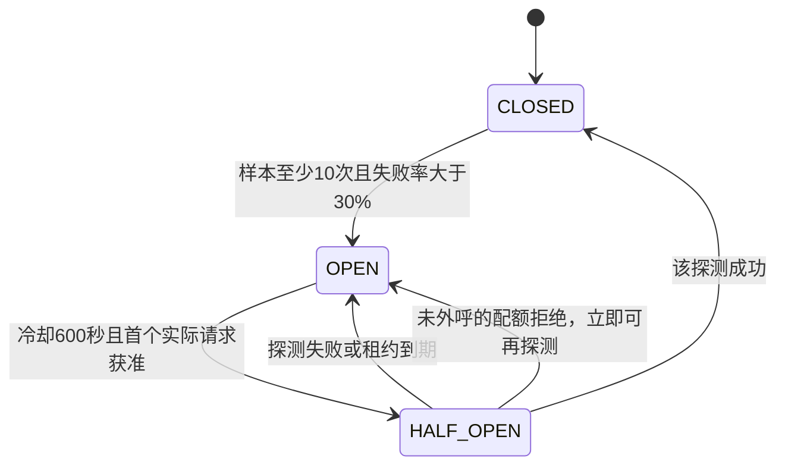

# 模型熔断与恢复：开发及答辩复盘

本批解决“模型反复失败仍继续等待和扣额度”的问题。用户自定义AI规划增加共享熔断；基础规则推荐持续可用。新增能力和全部故障证据见[接口与页面实测](模型熔断接口与页面实测.md)，进度接续见[进度](模型熔断进度.md)。真实模型质量尚未验证。

## 怎样解释熔断

超时限制一次请求要等多久；配额限制允许调用多少次；熔断根据近期故障决定是否值得继续外呼。这三件事分别实现，不能用小时限额代替服务故障判断。

状态名CLOSED表示调用通路正常，OPEN表示暂时暂停，HALF_OPEN表示冷却结束后仅允许一次恢复探测。页面用自然语言展示这些状态。

默认统计最近300秒，以完成时间纳入每次实际外呼，失败率严格`failed*100 > total*30`。在BR-AIC-07原规则上增加默认最小10次样本，避免单个临时失败立即关闭低频用户的模型；这是明确的实施补充，并非原文已经规定。九次全失败仍可调用，第十次开放，这个默认行为已真实测试。

成功半开探测清旧窗口，以该成功调用作为新窗口第一个样本；失败探测保留当前窗口并增加失败样本。窗口自然过期不会提前取消已有600秒冷却。没有自动定时访问模型，用户再次点击测试或生成才探测，因此不会在后台额外花模型额度。

## 为什么按用户及配置隔离

同一个地址可能被不同账号、模型、Key使用。某用户Key过期不说明其他用户模型失败，因此标识包含认证userId、服务端校验后的完整completion URI、模型名、去首尾空白的Key。localhost/127.0.0.1和基础路径尾斜杠由已有策略统一。

Java把地址+模型+Key用无歧义分隔符拼接后SHA-256；Redis key只含用户ID和摘要，不保存原始地址或Key。更换Key可以重新测试修复后的鉴权。该摘要不是密钥加密，也不是防猜测保险箱；Redis依然应作为受保护基础设施。改变配置创建新桶不会突破用户总配额。

隔离是一个取舍：本批不做跨用户供应商全局熔断，供应商大范围停机时各配置仍要积累自己的最小样本。未来可增加服务级门禁，但不能让一个错误Key全局关闭其他用户。

## 代码如何协作

| 文件 | 职责 |
|---|---|
| `trip-server/src/main/java/com/trip/module/ai/PlannerCircuitService.java` | 参数校验、身份摘要、准入凭据、安全503、对外状态DTO |
| `trip-server/src/main/resources/redis/ai_circuit.lua` | 滑动窗口、状态迁移、单探测租约、代次判定、TTL，原子执行 |
| `PlannerService.java` | 每次外呼前熔断→配额，外呼及结构结果计成功/失败，未外呼时释放探测；原操作审计保持一行 |
| `PlannerController.java` | 当前用户POST状态接口，沿用连接验证与目标限制 |
| `trip-web/src/api/modules/planner.ts`、`views/plan/AiPlanner.vue` | 状态请求、倒计时、禁用、基础推荐入口，连接改变及离页丢弃旧状态 |

每个桶有同一个Redis Cluster hash tag下的state hash、events zset、failures zset。外呼UUID作成员，完成时刻作score；按窗口删旧成员再计数量。三个key均显式传入Lua的KEYS，JSON字符串返回避免混合Redis类型反序列化。

Redis脚本串行原子执行，因此不同应用进程不会同时取得同一桶的半开探测。使用Redis TIME避免各应用节点时钟偏差，Redis5使用效果复制支持脚本中的时间读取。脚本报错不会撤销之前的写入，因此先检查key类型/状态再操作。这里依据[Redis官方脚本说明](https://redis.io/docs/latest/develop/programmability/eval-intro/)，实际5.0.14.1中执行已通过。

每次开放、探测、恢复都有新的generation；complete/abandon只有generation及探测ticket匹配才生效。先被放行但晚返回的旧请求不能改变后来状态。90秒探测租约大于默认45秒外呼上限；配置要求租约至少大于客户端实际超时1秒。进程崩溃未回报后，下一次读/准入把过期探测重新设OPEN冷却600秒，避免永久卡死。

Key TTL为`2*(window+cooldown+lease)`，默认1980秒。活动写入延长TTL，状态读取不续命；空状态读取不创建key。熔断窗口仅记录外呼结果，不保存正文、提示词、Key和供应商错误文本。恶意/大量配置仍可能增加短期key数，生产负载和容量测试尚未做。

## 次数、失败与降级怎样算

准入顺序：连接/输入校验→原用户/进程并发限制→熔断→配额→模型→输出校验→完成状态。生成模板缺失或输入非法不会进入外呼样本。

- 每次外呼消耗一次quota；失败不退款；JSON结构重试又走熔断和quota。
- HTTP401/403/429等供应商错误、超时、网络/协议、超大/空响应、结构失败都计为该配置失败。
- 本地输入、模板、并发、配额错误不是供应商故障，未外呼不记样本或模型操作审计。
- 若已经预留半开，但quota拒绝，abandon释放它，立即允许再探测，不伪造一次失败或再加10分钟等待。
- 熔断拦截发生在quota之前，无外呼、无扣次、无伪造模型日志。一次生成首个失败已外呼，第二次被熔断时，仍记录该操作一行失败审计。
- 半开结构失败立即重新开放；下一轮结构重试被503阻止。用户看到暂停提示，可换连接/等待/走基础推荐，不能把规则路线冒充模型生成行程。

普通生成成功一次操作可能含两个样本（先坏后好），因此熔断样本数、额度次数与审计操作数不一定相同。状态成功恢复不证明模型旅行建议真实可信，保存前仍要求用户确认。

Redis状态损坏或不可用时安全503，不继续外呼。若模型已响应而状态写回失败，本次也报503，实际外呼仍计额度及失败操作审计，避免宣称恢复状态已经可靠保存。这是基础设施故障语义，不应读作供应商本次一定失败。

## 页面为何使用相对计时及版本号

服务端返回retryAfterSeconds，前端用performance.now计算剩余秒，减少用户电脑时间改变的影响；倒计时不是授权，服务端仍作最终准入。到期可点击一次恢复；HALF_OPEN须刷新查结果，页面不自动产生探测。

地址/模型/Key变化立即清旧状态和预览，状态请求序号只接受当前版本；真实HTTP响应被延迟后切Key的浏览器测试证明旧状态不会覆盖新配置。离页清Key并停止计时器。状态刷新免费，但故意切配置不能跳过总quota或服务端目标白名单。

## 常见答辩问题

1. **为什么选择Redis，不只用Java变量？** 原并发锁仍是单进程；熔断必须共享统计与探测门禁。实际并发测试用八个独立Redis客户端，只有一个探测，不把这说成八实例负载压测。
2. **10分钟必须等满才能答辩演示吗？** 8080真实默认状态已验证600秒；自动恢复测试使用隔离8081短时间，说明清楚配置差异。演示可按实测文档启动隔离环境，不修改正式环境。
3. **为什么不是失败三次就开放？** 本批依据失败比例和滑动窗口，并加最小样本。7成功3失败=30%不触发，7成功4失败>30%触发。
4. **同一请求重试会多花钱吗？** 会，实际每次外呼扣次，结构失败最多重试一次；半开失败后阻止重试。预览不自动保存。
5. **熔断时系统还能用吗？** 规则意图/数据库路线匹配、已有资料/规划等不依赖自定义模型，该用户可点击基础推荐。
6. **测试能证明AI质量吗？** 只能证明真实应用协议、状态、计数及页面行为。受控服务不评估真实性、路线合理性或真实厂商可用性。

## 部署与剩余任务

无SQL迁移。新增环境变量：`TRIP_AI_CIRCUIT_WINDOW_SECONDS=300`、`COOLDOWN_SECONDS=600`、`MINIMUM_CALLS=10`、`FAILURE_PERCENT=30`、`PROBE_LEASE_SECONDS=90`；后四项也使用完整`TRIP_AI_CIRCUIT_`前缀。Redis脚本要求TIME/效果复制支持（本机Redis5已验证）；真实集群、重启恢复、故障转移和负载尚未专门验收，TTL/状态保留取决于Redis持久化策略。

下一批建议用户自定义AI规划的SSE进度、取消与完成事件契约，保留输出完整校验及非流式回退；之后RAG、多路召回/模型重排、评论情感及已有规划AI优化。真实模型质量仍需用户在本机配置服务，不能提交Key。邮箱验证/找回密码、生产云存储、高级运营及主包优化不属于本批交付。
