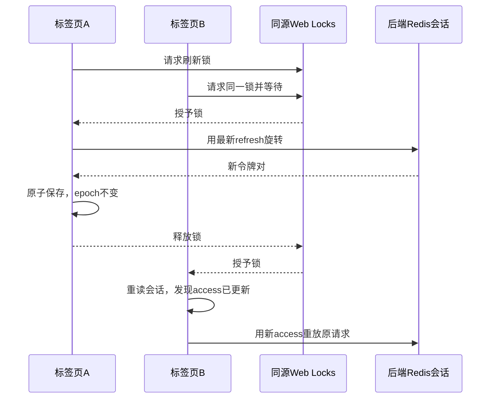

# 用户侧收尾开发与答辩复盘

2026-09-28，配套[实测报告](用户侧收尾接口与页面实测.md)及[进度](用户侧收尾进度.md)。本批让用户的统计、偏好和会话流程形成可演示的闭环；基础推荐仍是规则与数据库，不把偏好合并称为模型推理。

## 演示顺序

1. 登录进入`/user/profile`查看四类个人记录，新用户为0；实际收藏/预约/保存规划后点击刷新看计数变化。
2. `/user/preference`保存常用天数、人均参考预算、偏好及避雷标签。
3. `/recommend`输入没有明确天数/预算的需求，查看默认值来源；确认后比较实际条件与结果。关闭默认值开关，或手动清空限制后再确认，看候选扩大。
4. 输入明确的5天/500元/美食，本次条件优先；查看路线详情。目的地下架后公开详情和关联路线不再展示，恢复后可重试。
5. 展示跨页真实测试证据：四个请求共用一次旋转；退出/切换账号/同账号新登录不被旧响应覆盖。

演示账号和路线应使用自己的演示数据；验收生成的临时记录已经删除，报告里的routeId不保证还能访问。

## 个人统计与计数口径

Profile.vue调用既有`GET /user/stats`，独立于资料加载。数据库按当前认证用户ID计数，URL传userId不改变身份。收藏是当前收藏行数；预约含所有状态，是历史预约记录量；评论和规划排除逻辑删除。接口仍返回chatCount以保持契约，页面只展示已接通的四类产品能力。

收藏/预约/规划卡片有对应入口。评论不添加不存在的“我的评论”路由。加载失败说明并提供刷新；资料保存/上传捕获预期失败，避免未处理的Promise。统计按需刷新，未引入自动轮询或跨页业务缓存。

## 偏好合并与可解释推荐

保存偏好是长期默认值，本次确认内容是一次请求的具体条件。两者不能简单用`value || savedValue`合并，因为null/[]是用户主动清空的合法表达。

| 情形 | 结果 |
|---|---|
| 直接API省略useSavedPreference | 不合并，兼容旧调用 |
| 明确true且缺少days键 | 用保存的preferredDays |
| 明确true且days:null | 不限天数 |
| 三个预算键均缺少 | 用保存范围 |
| 任一预算键明确存在 | 整个预算组以本次请求为准，未给的端不限 |
| 标签键缺少 | 用保存标签 |
| 标签键是[]或null | 本次清空 |
| 明确偏好与保存避雷冲突 | 移除保存避雷的冲突项 |
| 明确避雷与保存偏好冲突 | 移除保存偏好的冲突项 |
| 本次两组明确标签重叠 | 拒绝，让用户修正 |

PreferenceMatchService用containsKey区分缺键和清空，只读取token身份的设置，合并后进入MatchCriteria统一校验。明确标签先strip再解决与保存标签的冲突，避免“ 探险 ”与“探险”比较时序错误。

页面采用确认快照：读取偏好后，为规则解析的未知项预填，记录哪些字段来自默认值，允许用户修改。点击确认时把页面展示的天数/预算/标签全部明确发送，保证服务端不悄悄重新读取一份与界面不同的默认值。因此页面预填时savedPreferenceFields可能为空；该字段描述服务端本次补入内容，页面来源说明描述客户端预填，两者用途不同。

开关关闭时只移除仍等于原默认值的字段，保留手动编辑。手动清空不触发自动补回；新解析/明确重新开启默认值/重新加载偏好才可能预填。需求或条件改变时revision使旧结果失效，晚到响应不覆盖当前条件。

TravelTags与travelTags把保存、解析、匹配、页面选项统一为21标签。前后端因语言不同各有一份常量；新增标签需一起修改，后续可改服务端公开词表。海滨/海边当前视为不同标签，未做同义词扩展。解析最多抽取5偏好，保存和手动匹配最多8，不要求解析必须填满保存上限。

预算使用BigDecimal，price>=下限且<=上限；小数最多两位，0/null代表对应端不限。新匹配范围允许上下限相等，保存长期偏好仍沿用严格下限小于上限或两端0的规则。旧budget保持整数1—1000000，不强制迁移旧调用。

偏好是软排序：命中数量降序→平均用户评分降序→路线ID升序；排除是硬过滤。recallScore为命中数/偏好数，llmScore为空，source=RULE_BASED。路线和父目的地均需上架且未删除；SQL参数化，不拼接用户输入。返回effectiveCriteria说明实际筛选，unsupportedCriteria列出未使用字段。同行人/节奏/月份/必去景点还没有可靠结构化依据，不宣称生效。

## 多标签页刷新与会话版本

后端Redis CAS保证一个refresh版本只能旋转一次。原前端的Promise只共享在一个页面，两个页面同时拿旧refresh请求，后端会让其中一个成功、另一个401；失败页再清localStorage，把成功页也退出。这是协调问题，不能用关闭后端CAS解决。

现在流程为：

request.ts锁内重读最新会话，有新access就跳过刷新；锁等待上限20秒，刷新请求15秒，每个原请求最多重放一次。网络错误/503不是令牌无效证明，保留会话提示重试；真实401只清除仍属于那一轮请求的会话。晚到旧401不能清掉新令牌。

storage.ts以trip_authSession一个JSON写入完整access/refresh/userInfo/epoch，旧三个键仅兼容镜像。读取优先原子键，旧完整三键可迁移；损坏的原子JSON不会静默回退为另一份旧会话。跨页storage事件和当前页通知更新菜单及路由。

epoch是登录轮次：新登录生成，刷新保持。仅比用户ID不够，因为同账号退出后再登录也应当隔离旧请求。原请求、刷新完成、重放前及成功响应均核对身份与epoch。退出后旧响应不能复活登录；换账号后旧请求不能重放为新账号；同账号新登录的令牌也不能被旧刷新覆写。randomUUID不可用时用独立随机标记生成epoch，它不是认证凭据，实际访问仍取决于后端签名令牌/Redis会话。

App按epoch给router-view设置key：新登录/退出清除已挂载页面的表单和列表，重新读取当前用户数据，防止菜单已换账号但旧表单仍可见。正常刷新保持epoch，页面不会重置。退出时受保护路由跳登录，失去管理员身份离开后台；请求级保护与页面状态隔离一起生效。

Web Locks要求支持该API的同源环境，生产使用HTTPS，localhost实际验收可用。不同端口/主机不共享localStorage及锁；不同设备拥有独立后端session。缺少Web Locks时明确提示重新登录；未实现非安全HTTP环境的自动刷新替代锁。持锁页关闭会由浏览器管理锁释放，相关机制见[MDN Web Locks API](https://developer.mozilla.org/en-US/docs/Web/API/Web_Locks_API)；本轮未用关闭标签页替代所有故障测试。

## 验收工具与复盘

真实HTTP和浏览器是本批判断依据：保存成功不等于推荐读取了偏好，单页刷新成功不等于两页同时刷新安全。测试先保留失败基线，再复跑相同条件并扩展身份/小数/清空/冲突/在途响应边界。

收尾还发现旧Windows CLI的--scan静默空输出。工具成功退出不等于预期语义执行：清理必须读取显式SCAN游标，校验响应格式，限制用户前缀，删除后再次扫描。Python空数组表示又产生一次解析失败，已保留并恢复夹具。每轮记录ID可以在中断后明确恢复，不能对未知数据做整库删除。旧证据的清理结论有修正说明，业务断言与工具失败分别记录。

Maven编译会触发本机DevTools重启，不能同时做活服务验收；先编译、再等健康UP。预算显示两位小数应比较数值，隐藏原生checkbox应点击可见交互元素；截图需等待布局和绘制稳定，不能仅以“无横向溢出”替代人工检查。

## 答辩问题与边界

- 偏好有没有让模型“理解用户”？当前是可解释默认条件及规则排序。模型规划另有用户自定义服务入口，质量尚未用用户真实模型验收。
- 为什么返回实际条件？让用户确认内容、偏好默认值和实际筛选可以对照，防止黑箱放宽条件。
- 为什么清空用null/[]？表示用户主动取消限制，与没填写字段不同。
- 为什么用锁还要epoch？锁处理同轮次旋转，epoch处理退出/重新登录导致的会话替换，两者保护不同竞态。
- 为什么不重试所有错误？刷新401是认证问题，网络故障是暂时不可用；无差别重试/清空会造成额外旋转或误退出。

本批无需数据库迁移。仍未完成模型故障熔断、真实模型质量、多路召回/重排、SSE/RAG、情感分析和就地AI优化；邮箱验证/找回密码、高级后台与大包优化也仍有后续。下一功能优先按用户/服务隔离的模型故障熔断与恢复，并使用可控服务实际验收；真实Key只由用户在本机配置。
