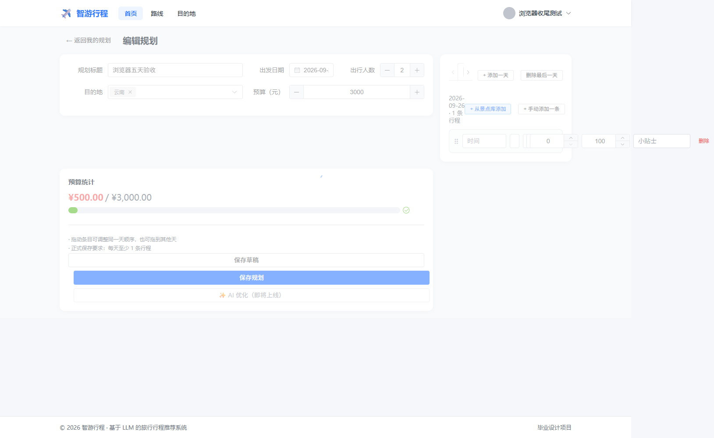
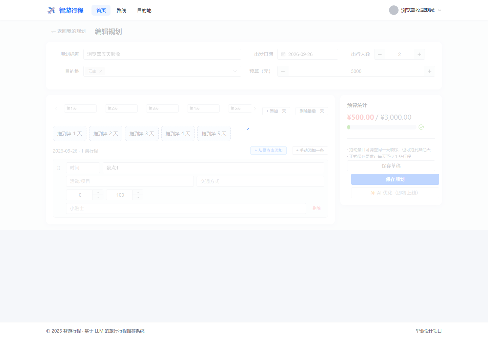

# 第2批接口实测与缺陷修复记录

> 测试日期：2026-09-26（Asia/Shanghai）。本文由真实 HTTP 响应、SQL 断言和真实 Edge 浏览器运行结果整理。不是设计示例，也不是仅阅读代码后的推断。

## 1. 结论与证据

- 修复前：97 项检查，76 项通过，21 项未达预期。失败检查数不等于独立缺陷数，同一个根因可能触发多项失败。
- 修复后：111 项接口/数据检查全部通过（包含注册、登录、夹具清理、并发结果和 SQL 断言；不是 111 个不同接口）。新增专项回归未在旧版本执行，不能据此声称它们旧版必然失败。
- 浏览器：27 项检查全部通过。真实 Vite 代理 + 后端 + MySQL，没有拦截替换接口响应。
- `mvn test`：1 个应用上下文测试通过。它不是业务覆盖率证明；业务证据来自本报告 HTTP/SQL 和浏览器测试。
- `npm run build`：类型检查与生产构建通过；仍有主包约 1.12 MB 的体积警告。
- 原始数据：[修复前](evidence/baseline/responses.json)、[最终回归](evidence/regression/responses.json)、[浏览器修复前](evidence/browser-baseline/results.json)、[浏览器最终回归](evidence/browser-regression/results.json)。JWT 和密码已在落盘时脱敏。
- 最终接口运行时间：`2026-09-26T20:41:43.917294`；浏览器运行时间（UTC）：`2026-09-26T12:44:34.382Z`。

## 2. 环境、请求约定与数据保护

- 本机 Windows；Spring Boot 4.0.8；Maven 3.9.14 实际使用 JDK 21.0.2（项目编译目标 Java 17）；MySQL 8；Vue 3/Vite 8。
- 后端 `http://localhost:8080/api`，前端 `http://127.0.0.1:5173`。第2批启动使用 `--spring.ai.model.chat=none`，不调用真实大模型。
- 业务异常沿用统一 R 响应：通常 HTTP 200 + `code=400/403/409/2002...`；Security 层明确返回 HTTP 401/403 + 同名业务 code。测试分别记录 HTTP 状态与业务 code，不把 HTTP 200 等同于业务成功。
- 接口脚本每轮创建 3 个独立测试用户和 3 条临时路线。预约日期按运行日动态生成，避免历史日期失效。数据库仅用于构造隔离夹具、核验持久化和清理；所有被测业务操作均走真实 HTTP。
- `finally` 清理只删除本轮创建的用户及关联数据，不重建数据库，不重置演示数据。浏览器使用独立账号，在路线201上执行成对点赞/取消、收藏/取消、预约/取消、评论/删除；清理后重算所触及路线计数。
- 自增 ID 会产生空洞，逻辑删除留下的测试数据最终被夹具清理。测试不是生产环境压测。

## 3. 缺陷台账（现象 → 原因 → 修复 → 证据）

| 编号 | 实际现象 | 根因 | 解决方案与验证 |
|---|---|---|---|
| B2-01 | 匿名请求规划返回 HTTP403；USER 管理接口响应不是统一 R | Security 未配置认证入口和拒绝处理器 | 匿名401、权限不足403，均输出 JSON code；两项回归通过 |
| B2-02 | 缺 routeId、非法路径参数返回 code500 | 参数绑定异常进入通用兜底 | 显式处理缺参数/类型不符/方法校验异常，返回400 |
| B2-03 | size=-1 被接受 | 仅限制分页上限，没有下限 | 互动、规划分页校验 current/size ≥1 |
| B2-04 | 同一用户并发取消点赞有一个 code500 | 两个事务同时查到同一记录，删除后各自减计数，unsigned 字段可能下溢 | 路线行锁后读取状态，串行切换与原子加减；收藏同路径修复，评论点赞使用当前读；并发回归通过 |
| B2-05 | 已确认3人、名额3人，另1人仍可提交 | selectCount 统计订单数，不是 SUM(people_num) | 当前读已确认订单并累加人数，提交返回2002 |
| B2-06 | 两个2人订单并发确认，在3人名额下都成功 | 审核入口没有名额校验，也没有共享路线锁 | 审核与提交共享路线锁，确认前重检；结果200/2002，确认人数2 |
| B2-07 | 管理员取消后 booking_count 与明细不一致 | 审核仅改状态，未同步计数/取消时间 | 管理员取消也减计数、记时间；用户取消在同锁内重读，防重复扣减 |
| B2-08 | 可跨路线回复、可回复隐藏评论 | 只检查父评论是否顶级，没检查所属路线和显示状态 | 父评论必须同路线、显示中且顶级；两项400 |
| B2-09 | 隐藏请求缺 status 返回500 | Controller 缺 @Valid，Integer 拆箱空指针 | 补 @Valid，Service 空值兜底；返回400 |
| B2-10 | 隐藏1星后平均分仍3.67，应5.00 | 隐藏/恢复时不重算评分 | 同事务同路线锁下重算显示中未删除评论均分；回归5.00 |
| B2-11 | 5个并发评论均写入，突破每日3条 | 先查再插未互斥 | 路线锁内执行限额检查、插入和计数；实测仅3条 |
| B2-12 | 有空天的草稿保存失败 | 每天至少一项的规则也应用于草稿 | 正式保存严格校验，草稿允许空天；草稿200，正式空项仍400 |
| B2-13 | days=2但提交5天、status=9也能保存 | 缺少结构一致性和枚举范围校验 | 天数与非空 dayList 长度一致，status只能0/1 |
| B2-14 | null天、null项、过长天标题返回500 | 集合元素未@NotNull，嵌套字段未限制长度 | 容器元素校验+天标题/摘要/时间点长度，全部400，数据库写入前拒绝 |
| B2-15 | 浏览器详情页失败，错误 tags.split is not a function | 实际 tags 是数组，前端类型声明和处理按字符串 | RoutePageVO.tags改为string[]，卡片/详情直接渲染数组；详情目的地读destination.name |
| B2-16 | 编辑后保存住宿/餐食/每日摘要变空 | loadDetail/buildDTO 漏映射字段；后端整体替换因此删除原值 | 补齐三个字段双向映射；浏览器保存再查库三项保持原值 |
| B2-17 | 编辑区挤在300px侧栏，标题输入框不可见 | 三张卡片自动填充两列Grid，基本信息没跨列；行程行过多固定宽控件 | 基本信息跨列，行程区占主列，条目使用可伸缩Grid；修复前后截图可对照 |
| B2-18 | 文案说支持跨天拖动，但页面无可用目标 | 只渲染当前一天的draggable，共用group不会凭空产生另一天列表 | 加持久可见的跨天投放区和拖拽手柄；真实鼠标将景点1移到第2天，保存重开一致 |
| B2-19 | 前端允许规划50人、预约20人，后端只允许10人 | 前后端约束不一致 | 两处max=10，预算下限0.01、天数最多30；浏览器核验aria-valuemax=10 |
| B2-20 | unknown被显示成中评；筛选值使用大写 | 后端枚举是小写positive/neutral/negative/unknown | 改用小写，unknown不显示情感结论；浏览器校验新评论不显示中评 |
| B2-21 | 用户页缺评论回复/删除/点赞入口，评论只能看首页 | 后端已具备但页面未接入 | 补回复对象提示、本人删除、点赞、分页、图片列表展示；发表/回复/删除浏览器实测通过 |

### 审查补强（与“旧版实测失败”分开）

- 预约号原为“当天最大流水+1”，不同路线锁不能互斥这段逻辑。改为32位随机 UUID 字符串，数据库唯一索引继续兜底。前端只展示单号，不解析格式；API 示例同步。新增并发跨路线预约验证两个号不同。此风险通过代码发现，未声称旧版已复现碰撞。
- 规划50条上限增加用户行锁与当前读，同时覆盖创建/复制/模板入口。旧版该轮恰好未超限，仍存在先查后插竞争；最终49条时并发创建只允许到50条，三个入口超限拒绝。
- 规划更新先锁主表，避免两个“先删后插”交错；复制200字标题时截断原始部分再加后缀；收藏列表过滤已删除路线，避免空引用。这些是代码审查补强，未做对应旧版失败复现。
- 从路线生成规划后立即替换为 `/plan/{id}/edit`，避免刷新创建第二份。此项代码修复，最终专项浏览器覆盖见开发文档；不要将API模板成功等同于刷新专项已测。

## 4. 全部最终检查清单

“SQL/assert”是与真实数据库/并发返回结果比较的断言；HTTP请求的完整请求体和响应体见原始JSON。

| # | 场景 | 方法与路径 | HTTP | 业务code/断言结果 | 结论 |
|---|---|---|---|---|---|
| 1 | 注册测试账号 a | `POST /auth/register` | 200 | `200` | 通过 |
| 2 | 登录 a | `POST /auth/login` | 200 | `200` | 通过 |
| 3 | 注册测试账号 b | `POST /auth/register` | 200 | `200` | 通过 |
| 4 | 登录 b | `POST /auth/login` | 200 | `200` | 通过 |
| 5 | 注册测试账号 c | `POST /auth/register` | 200 | `200` | 通过 |
| 6 | 登录 c | `POST /auth/login` | 200 | `200` | 通过 |
| 7 | 管理员登录 | `POST /auth/login` | 200 | `200` | 通过 |
| 8 | 匿名规划应401 | `GET /plan/page` | 401 | `401` | 通过 |
| 9 | USER不能管理预约 | `GET /admin/interaction/booking/page` | 403 | `403` | 通过 |
| 10 | 公开评论 | `GET /interaction/comment/page?routeId=233` | 200 | `200` | 通过 |
| 11 | 缺少routeId | `GET /interaction/comment/page` | 200 | `400` | 通过 |
| 12 | 非法路径参数 | `GET /plan/abc` | 200 | `400` | 通过 |
| 13 | 负分页大小 | `GET /plan/page?size=-1` | 200 | `400` | 通过 |
| 14 | 点赞缺参数 | `POST /interaction/like` | 200 | `400` | 通过 |
| 15 | 点赞不存在路线 | `POST /interaction/like` | 200 | `2001` | 通过 |
| 16 | 点赞 | `POST /interaction/like` | 200 | `200` | 通过 |
| 17 | 点赞状态 | `GET /interaction/like/233/status` | 200 | `200` | 通过 |
| 18 | 详情点赞回显 | `GET /route/233` | 200 | `200` | 通过 |
| 19 | 并发取消点赞2 | `POST /interaction/like` | 200 | `200` | 通过 |
| 20 | 并发取消点赞1 | `POST /interaction/like` | 200 | `200` | 通过 |
| 21 | 并发toggle计数一致 | `SQL/assert ` | — | `"1"` | 通过 |
| 22 | 收藏 | `POST /interaction/favorite` | 200 | `200` | 通过 |
| 23 | 收藏列表 | `GET /interaction/favorite/page` | 200 | `200` | 通过 |
| 24 | 取消收藏 | `POST /interaction/favorite` | 200 | `200` | 通过 |
| 25 | 预约今天拒绝 | `POST /interaction/booking` | 200 | `400` | 通过 |
| 26 | 预约人数0 | `POST /interaction/booking` | 200 | `400` | 通过 |
| 27 | 预约3人 | `POST /interaction/booking` | 200 | `200` | 通过 |
| 28 | 预约重复 | `POST /interaction/booking` | 200 | `2004` | 通过 |
| 29 | 预约列表 | `GET /interaction/booking/page` | 200 | `200` | 通过 |
| 30 | 越权取消预约 | `PUT /interaction/booking/9104/cancel` | 200 | `403` | 通过 |
| 31 | 确认3人 | `PUT /admin/interaction/booking/9104/status` | 200 | `200` | 通过 |
| 32 | 人数已满拒绝新预约 | `POST /interaction/booking` | 200 | `2002` | 通过 |
| 33 | 已确认不能再次确认 | `PUT /admin/interaction/booking/9104/status` | 200 | `409` | 通过 |
| 34 | 取消已确认预约 | `PUT /interaction/booking/9104/cancel` | 200 | `200` | 通过 |
| 35 | 重复取消预约 | `PUT /interaction/booking/9104/cancel` | 200 | `409` | 通过 |
| 36 | 取消后重约 | `POST /interaction/booking` | 200 | `200` | 通过 |
| 37 | 管理员拒绝预约 | `PUT /admin/interaction/booking/9105/status` | 200 | `200` | 通过 |
| 38 | 管理员取消同步预约计数 | `SQL/assert ` | — | `"1"` | 通过 |
| 39 | 待审2人A | `POST /interaction/booking` | 200 | `200` | 通过 |
| 40 | 待审2人B | `POST /interaction/booking` | 200 | `200` | 通过 |
| 41 | 并发审核B | `PUT /admin/interaction/booking/9107/status` | 200 | `200` | 通过 |
| 42 | 并发审核A | `PUT /admin/interaction/booking/9106/status` | 200 | `2002` | 通过 |
| 43 | 并发审核仅一单通过 | `SQL/assert ` | — | `[200, 2002]` | 通过 |
| 44 | 确认人数不超3 | `SQL/assert ` | — | `true` | 通过 |
| 45 | 发表评论 | `POST /interaction/comment` | 200 | `200` | 通过 |
| 46 | 评论短文本 | `POST /interaction/comment` | 200 | `400` | 通过 |
| 47 | 图片超过3张 | `POST /interaction/comment` | 200 | `400` | 通过 |
| 48 | 跨路线回复应拒绝 | `POST /interaction/comment` | 200 | `400` | 通过 |
| 49 | 正常回复 | `POST /interaction/comment` | 200 | `200` | 通过 |
| 50 | 拒绝第三层回复 | `POST /interaction/comment` | 200 | `400` | 通过 |
| 51 | 评论点赞 | `POST /interaction/comment/5271/like` | 200 | `200` | 通过 |
| 52 | 评论取消点赞 | `POST /interaction/comment/5271/like` | 200 | `200` | 通过 |
| 53 | 越权删除评论 | `DELETE /interaction/comment/5271` | 200 | `403` | 通过 |
| 54 | 隐藏缺status | `PUT /admin/interaction/comment/5271/status` | 200 | `400` | 通过 |
| 55 | 低分评论 | `POST /interaction/comment` | 200 | `200` | 通过 |
| 56 | 管理员隐藏评论 | `PUT /admin/interaction/comment/5273/status` | 200 | `200` | 通过 |
| 57 | 隐藏后均分重算 | `GET /admin/interaction/stat/233` | 200 | `200` | 通过 |
| 58 | 拒绝回复隐藏评论 | `POST /interaction/comment` | 200 | `400` | 通过 |
| 59 | 显示评论 | `PUT /admin/interaction/comment/5273/status` | 200 | `200` | 通过 |
| 60 | 管理评论列表 | `GET /admin/interaction/comment/page?routeId=233` | 200 | `200` | 通过 |
| 61 | 并发评论3 | `POST /interaction/comment` | 200 | `200` | 通过 |
| 62 | 并发评论1 | `POST /interaction/comment` | 200 | `200` | 通过 |
| 63 | 并发评论0 | `POST /interaction/comment` | 200 | `200` | 通过 |
| 64 | 并发评论2 | `POST /interaction/comment` | 200 | `2005` | 通过 |
| 65 | 并发评论4 | `POST /interaction/comment` | 200 | `2005` | 通过 |
| 66 | 并发评论每天最多3条 | `SQL/assert ` | — | `"3"` | 通过 |
| 67 | 删除自己的评论 | `DELETE /interaction/comment/5271` | 200 | `200` | 通过 |
| 68 | 创建五天规划 | `POST /plan` | 200 | `200` | 通过 |
| 69 | 读取五天重排 | `GET /plan/234` | 200 | `200` | 通过 |
| 70 | 规划越权 GET/plan/234 | `GET /plan/234` | 200 | `403` | 通过 |
| 71 | 规划越权 PUT/plan/234 | `PUT /plan/234` | 200 | `403` | 通过 |
| 72 | 规划越权 DELETE/plan/234 | `DELETE /plan/234` | 200 | `403` | 通过 |
| 73 | 规划越权 POST/plan/234/copy | `POST /plan/234/copy` | 200 | `403` | 通过 |
| 74 | 规划越权 POST/plan/234/export | `POST /plan/234/export` | 200 | `403` | 通过 |
| 75 | 跨天重排保存 | `PUT /plan/234` | 200 | `200` | 通过 |
| 76 | 重开顺序和预算 | `GET /plan/234` | 200 | `200` | 通过 |
| 77 | 导出文本 | `POST /plan/234/export` | 200 | `200` | 通过 |
| 78 | 深复制 | `POST /plan/234/copy` | 200 | `200` | 通过 |
| 79 | 副本草稿及内容 | `GET /plan/235` | 200 | `200` | 通过 |
| 80 | 模板生成 | `POST /plan/from-route/201` | 200 | `200` | 通过 |
| 81 | AI占位 | `POST /plan/234/ai-optimize` | 200 | `3001` | 通过 |
| 82 | 草稿空天 | `POST /plan` | 200 | `200` | 通过 |
| 83 | 天数不一致 | `POST /plan` | 200 | `400` | 通过 |
| 84 | 非法status | `POST /plan` | 200 | `400` | 通过 |
| 85 | 过去日期 | `POST /plan` | 200 | `400` | 通过 |
| 86 | 预算0 | `POST /plan` | 200 | `400` | 通过 |
| 87 | null天 | `POST /plan` | 200 | `400` | 通过 |
| 88 | null项 | `POST /plan` | 200 | `400` | 通过 |
| 89 | 天标题过长 | `POST /plan` | 200 | `400` | 通过 |
| 90 | 规划列表 | `GET /plan/page?status=1` | 200 | `200` | 通过 |
| 91 | 删除规划 | `DELETE /plan/234` | 200 | `200` | 通过 |
| 92 | 删除后不可读取 | `GET /plan/234` | 200 | `403` | 通过 |
| 93 | 并发规划上限A | `POST /plan` | 200 | `200` | 通过 |
| 94 | 并发规划上限B | `POST /plan` | 200 | `2006` | 通过 |
| 95 | 规划上限严格50 | `SQL/assert ` | — | `"50"` | 通过 |
| 96 | 超过50条 | `POST /plan` | 200 | `2006` | 通过 |
| 97 | 上限时模板创建拒绝 | `POST /plan/from-route/201` | 200 | `2006` | 通过 |
| 98 | 上限时复制拒绝 | `POST /plan/235/copy` | 200 | `2006` | 通过 |
| 99 | 跨路线并发订单A | `POST /interaction/booking` | 200 | `200` | 通过 |
| 100 | 跨路线并发订单B | `POST /interaction/booking` | 200 | `200` | 通过 |
| 101 | 跨路线订单号不重复 | `SQL/assert ` | — | `2` | 通过 |
| 102 | 同账号重复预约竞争A | `POST /interaction/booking` | 200 | `200` | 通过 |
| 103 | 同账号重复预约竞争B | `POST /interaction/booking` | 200 | `2004` | 通过 |
| 104 | 并发重复预约一成一拒 | `SQL/assert ` | — | `[200, 2004]` | 通过 |
| 105 | 并发点赞用评论 | `POST /interaction/comment` | 200 | `200` | 通过 |
| 106 | 评论点赞竞争A | `POST /interaction/comment/5277/like` | 200 | `200` | 通过 |
| 107 | 评论点赞竞争B | `POST /interaction/comment/5277/like` | 200 | `200` | 通过 |
| 108 | 评论点赞两次恢复0 | `SQL/assert ` | — | `"0"` | 通过 |
| 109 | 合法三张图片评论 | `POST /interaction/comment` | 200 | `200` | 通过 |
| 110 | 图片列表回显 | `GET /interaction/comment/page?routeId=235` | 200 | `200` | 通过 |
| 111 | 测试夹具清理 | `SQL/assert ` | — | `"0"` | 通过 |

## 5. 修复前后真实响应对照

以下保留实际字段、时间戳和测试ID。SQL断言也保留原始值。测试ID已清理，复跑会生成新ID。

### 匿名规划应401

请求：`GET /plan/page`；角色：`None`。

修复前：
```json
{
  "http": 403,
  "response": {
    "timestamp": "2026-09-26T20:27:05.083+08:00",
    "status": 403,
    "error": "Forbidden",
    "message": "Forbidden",
    "path": "/api/plan/page"
  }
}
```

修复后：
```json
{
  "http": 401,
  "response": {
    "code": 401,
    "message": "请先登录",
    "data": null
  }
}
```

### USER不能管理预约

请求：`GET /admin/interaction/booking/page`；角色：`a`。

修复前：
```json
{
  "http": 403,
  "response": {
    "timestamp": "2026-09-26T20:27:05.088+08:00",
    "status": 403,
    "error": "Forbidden",
    "message": "Forbidden",
    "path": "/api/admin/interaction/booking/page"
  }
}
```

修复后：
```json
{
  "http": 403,
  "response": {
    "code": 403,
    "message": "无权访问",
    "data": null
  }
}
```

### 缺少routeId

请求：`GET /interaction/comment/page`；角色：`a`。

修复前：
```json
{
  "http": 200,
  "response": {
    "code": 500,
    "message": "服务器内部错误",
    "data": null,
    "timestamp": 1790425625148
  }
}
```

修复后：
```json
{
  "http": 200,
  "response": {
    "code": 400,
    "message": "请求参数缺失或格式不正确",
    "data": null,
    "timestamp": 1790426499138
  }
}
```

### 非法路径参数

请求：`GET /plan/abc`；角色：`a`。

修复前：
```json
{
  "http": 200,
  "response": {
    "code": 500,
    "message": "服务器内部错误",
    "data": null,
    "timestamp": 1790425625178
  }
}
```

修复后：
```json
{
  "http": 200,
  "response": {
    "code": 400,
    "message": "请求参数缺失或格式不正确",
    "data": null,
    "timestamp": 1790426499154
  }
}
```

### 负分页大小

请求：`GET /plan/page?size=-1`；角色：`a`。

修复前：
```json
{
  "http": 200,
  "response": {
    "code": 200,
    "message": "success",
    "data": {
      "current": 1,
      "pages": 0,
      "records": [],
      "size": -1,
      "total": 0
    },
    "timestamp": 1790425625209
  }
}
```

修复后：
```json
{
  "http": 200,
  "response": {
    "code": 400,
    "message": "分页参数须大于0",
    "data": null,
    "timestamp": 1790426499169
  }
}
```

### 并发取消点赞1

请求：`POST /interaction/like`；角色：`a`。

修复前：
```json
{
  "http": 200,
  "response": {
    "code": 500,
    "message": "服务器内部错误",
    "data": null,
    "timestamp": 1790425625325
  }
}
```

修复后：
```json
{
  "http": 200,
  "response": {
    "code": 200,
    "message": "success",
    "data": {
      "likeCount": 1,
      "liked": true
    },
    "timestamp": 1790426499267
  }
}
```

### 人数已满拒绝新预约

请求：`POST /interaction/booking`；角色：`b`。

修复前：
```json
{
  "http": 200,
  "response": {
    "code": 200,
    "message": "success",
    "data": {
      "bookingId": 9087,
      "bookingNo": "BK20260926002",
      "contactName": "收尾测试",
      "contactPhone": "13800000000",
      "createTime": "2026-09-26 20:27:05",
      "peopleNum": 1,
      "remark": "b2_1790425624",
      "routeId": 224,
      "routeTitle": "b2_1790425624_0",
      "status": 0,
      "travelDate": "2026-11-25"
    },
    "timestamp": 1790425625609
  }
}
```

修复后：
```json
{
  "http": 200,
  "response": {
    "code": 2002,
    "message": "预约人数已满",
    "data": null,
    "timestamp": 1790426499499
  }
}
```

### 管理员取消同步预约计数

请求：`SQL/assert `；角色：`数据断言`。

修复前：
```json
{
  "http": null,
  "response": "0"
}
```

修复后：
```json
{
  "http": null,
  "response": "1"
}
```

### 并发审核仅一单通过

请求：`SQL/assert `；角色：`数据断言`。

修复前：
```json
{
  "http": null,
  "response": [
    200,
    200
  ]
}
```

修复后：
```json
{
  "http": null,
  "response": [
    200,
    2002
  ]
}
```

### 确认人数不超3

请求：`SQL/assert `；角色：`数据断言`。

修复前：
```json
{
  "http": null,
  "response": false
}
```

修复后：
```json
{
  "http": null,
  "response": true
}
```

### 跨路线回复应拒绝

请求：`POST /interaction/comment`；角色：`b`。

修复前：
```json
{
  "http": 200,
  "response": {
    "code": 200,
    "message": "success",
    "data": {
      "content": null,
      "createTime": null,
      "id": 5247,
      "images": null,
      "likeCount": null,
      "liked": null,
      "parentId": null,
      "routeId": null,
      "score": null,
      "sentiment": "unknown",
      "sentimentScore": null,
      "userAvatar": null,
      "userId": null,
      "userNickname": null
    },
    "timestamp": 1790425625994
  }
}
```

修复后：
```json
{
  "http": 200,
  "response": {
    "code": 400,
    "message": "仅支持对顶级评论进行回复",
    "data": null,
    "timestamp": 1790426499764
  }
}
```

### 隐藏缺status

请求：`PUT /admin/interaction/comment/5246/status`；角色：`admin`。

修复前：
```json
{
  "http": 200,
  "response": {
    "code": 500,
    "message": "服务器内部错误",
    "data": null,
    "timestamp": 1790425626067
  }
}
```

修复后：
```json
{
  "http": 200,
  "response": {
    "code": 400,
    "message": "status 评论状态不能为空",
    "data": null,
    "timestamp": 1790426499867
  }
}
```

### 隐藏后均分重算

请求：`GET /admin/interaction/stat/224`；角色：`admin`。

修复前：
```json
{
  "http": 200,
  "response": {
    "code": 200,
    "message": "success",
    "data": {
      "avgScore": 3.67,
      "bookingCount": 2,
      "commentCount": 3,
      "favoriteCount": 0,
      "likeCount": 0,
      "routeId": 224,
      "viewCount": 0
    },
    "timestamp": 1790425626093
  }
}
```

修复后：
```json
{
  "http": 200,
  "response": {
    "code": 200,
    "message": "success",
    "data": {
      "avgScore": 5.0,
      "bookingCount": 0,
      "commentCount": 3,
      "favoriteCount": 0,
      "likeCount": 1,
      "routeId": 233,
      "viewCount": 0
    },
    "timestamp": 1790426499950
  }
}
```

### 拒绝回复隐藏评论

请求：`POST /interaction/comment`；角色：`b`。

修复前：
```json
{
  "http": 200,
  "response": {
    "code": 200,
    "message": "success",
    "data": {
      "content": null,
      "createTime": null,
      "id": 5250,
      "images": null,
      "likeCount": null,
      "liked": null,
      "parentId": null,
      "routeId": null,
      "score": null,
      "sentiment": "unknown",
      "sentimentScore": null,
      "userAvatar": null,
      "userId": null,
      "userNickname": null
    },
    "timestamp": 1790425626107
  }
}
```

修复后：
```json
{
  "http": 200,
  "response": {
    "code": 400,
    "message": "仅支持对顶级评论进行回复",
    "data": null,
    "timestamp": 1790426499967
  }
}
```

### 并发评论每天最多3条

请求：`SQL/assert `；角色：`数据断言`。

修复前：
```json
{
  "http": null,
  "response": "5"
}
```

修复后：
```json
{
  "http": null,
  "response": "3"
}
```

### 草稿空天

请求：`POST /plan`；角色：`a`。

修复前：
```json
{
  "http": 200,
  "response": {
    "code": 400,
    "message": "每天至少 1 条行程项（BR-PLN-01）",
    "data": null,
    "timestamp": 1790425626717
  }
}
```

修复后：
```json
{
  "http": 200,
  "response": {
    "code": 200,
    "message": "success",
    "data": 237,
    "timestamp": 1790426500356
  }
}
```

### 天数不一致

请求：`POST /plan`；角色：`a`。

修复前：
```json
{
  "http": 200,
  "response": {
    "code": 200,
    "message": "success",
    "data": 77,
    "timestamp": 1790425626745
  }
}
```

修复后：
```json
{
  "http": 200,
  "response": {
    "code": 400,
    "message": "天数须与行程天列表一致",
    "data": null,
    "timestamp": 1790426500384
  }
}
```

### 非法status

请求：`POST /plan`；角色：`a`。

修复前：
```json
{
  "http": 200,
  "response": {
    "code": 200,
    "message": "success",
    "data": 78,
    "timestamp": 1790425626761
  }
}
```

修复后：
```json
{
  "http": 200,
  "response": {
    "code": 400,
    "message": "status 最大不能超过1",
    "data": null,
    "timestamp": 1790426500386
  }
}
```

### null天

请求：`POST /plan`；角色：`a`。

修复前：
```json
{
  "http": 200,
  "response": {
    "code": 500,
    "message": "服务器内部错误",
    "data": null,
    "timestamp": 1790425626777
  }
}
```

修复后：
```json
{
  "http": 200,
  "response": {
    "code": 400,
    "message": "dayList[0] 不能为null",
    "data": null,
    "timestamp": 1790426500446
  }
}
```

### null项

请求：`POST /plan`；角色：`a`。

修复前：
```json
{
  "http": 200,
  "response": {
    "code": 500,
    "message": "服务器内部错误",
    "data": null,
    "timestamp": 1790425626788
  }
}
```

修复后：
```json
{
  "http": 200,
  "response": {
    "code": 400,
    "message": "dayList[0].items[0] 不能为null",
    "data": null,
    "timestamp": 1790426500448
  }
}
```

### 天标题过长

请求：`POST /plan`；角色：`a`。

修复前：
```json
{
  "http": 200,
  "response": {
    "code": 500,
    "message": "服务器内部错误",
    "data": null,
    "timestamp": 1790425626817
  }
}
```

修复后：
```json
{
  "http": 200,
  "response": {
    "code": 400,
    "message": "dayList[0].title 个数必须在0和100之间",
    "data": null,
    "timestamp": 1790426500461
  }
}
```

## 6. 浏览器实际结果

| 场景 | 实测 | 结论 |
|---|---|---|
| 浏览器登录跳转首页 | `"/"` | 通过 |
| 编辑器出行人数上限 | `"10"` | 通过 |
| 跨天目标可见 | `5` | 通过 |
| 保存保留住宿 | `"酒店0"` | 通过 |
| 保存保留用餐 | `"餐食0"` | 通过 |
| 保存保留摘要 | `"摘要0"` | 通过 |
| 鼠标跨天拖拽后首日剩一项 | `1` | 通过 |
| 跨天保存到第二天 | `["景点2", "景点1"]` | 通过 |
| 五天预算保持500 | `500` | 通过 |
| 刷新重开首日顺序 | `"同日第二项"` | 通过 |
| 景点抽屉真实数据 | `true` | 通过 |
| 页面点赞回显 | `true` | 通过 |
| 页面收藏回显 | `true` | 通过 |
| 页面发表评论 | `200` | 通过 |
| unknown不显示中评 | `0` | 通过 |
| 页面回复评论 | `200` | 通过 |
| 回复展示父评论 | `1` | 通过 |
| 页面删除本人评论 | `200` | 通过 |
| 页面删除本人评论 | `200` | 通过 |
| 预约人数上限 | `"10"` | 通过 |
| 浏览器预约接口成功 | `200` | 通过 |
| 页面取消预约 | `true` | 通过 |
| 浏览器空天草稿保存 | `200` | 通过 |
| 空草稿三天持久化 | `3` | 通过 |
| 模板创建后规范URL | `"http://127.0.0.1:5173/plan/287/edit"` | 通过 |
| 刷新不重复创建规划 | `3` | 通过 |
| 浏览器运行时异常 | `[]` | 通过 |

修复前编辑器：



修复后编辑器：



## 7. 复跑方法

先启动本地MySQL，确认已有演示库。不要重新执行schema.sql，否则会清空现有数据。

```powershell
# 终端1：后端
cd D:\demo_series\Trip-AI\trip-server
mvn spring-boot:run '-Dspring-boot.run.arguments=--spring.ai.model.chat=none'

# 终端2：前端
cd D:\demo_series\Trip-AI\trip-web
npm run dev -- --host 127.0.0.1

# 终端3：真实接口验收
cd D:\demo_series\Trip-AI\trip-server
$env:PYTHONIOENCODING='utf-8'
python scripts/batch2_acceptance.py regression

# 浏览器验收：需本机Edge和Playwright；可用PLAYWRIGHT_MODULE指定安装位置
cd D:\demo_series\Trip-AI\trip-web
node scripts/batch2_browser.cjs regression

# 更新本报告（只读取已存在证据，不执行测试）
cd D:\demo_series\Trip-AI\trip-server
python scripts/render_batch2_report.py
```

脚本默认使用本机开发数据库账号；可通过MYSQL_PASSWORD覆盖密码，通过TEST_BASE_URL覆盖接口地址。浏览器脚本默认使用本机已存在的Playwright，不会自动安装依赖。回归失败返回非零退出码。不要使用baseline参数覆盖本次保留的修复前证据。

## 8. 工具问题与未覆盖边界

- Maven首次启动因工作区外缓存写权限失败；授权后正常启动。离线mvn test因Surefire未缓存失败，联网获取依赖后1项测试通过。Vite沙箱子进程失败，授权后开发服务和构建正常。以上属于执行环境问题，不计为业务Bug。
- 最初接口脚本误取预约响应id而不是bookingId，已按真实VO更正；最初浏览器定位使用“用户名”而实际placeholder为user1001，已修正。最终证据排除这些测试脚本错误。一次失败创建的独立测试用户已按确切ID清理。
- 本次是本机功能/边界/小规模并发验收，不是高并发性能、跨浏览器兼容或生产安全审计。并发测试通过不意味着所有调度均被穷举。
- 评论接口三张图片URL存储/回显已实测；前端可展示已有图片，文件选择上传入口尚不在此次交付内。管理端接口已测，完整后台页面仍在后续批次。AI优化按约定返回3001占位，不算已实现AI。
- 前端主包体积警告、JDK动态Agent提示以及旧MyBatis-Plus弃用提示不影响本轮验收，后续按需处理。没有通过调高告警阈值隐藏体积问题。
